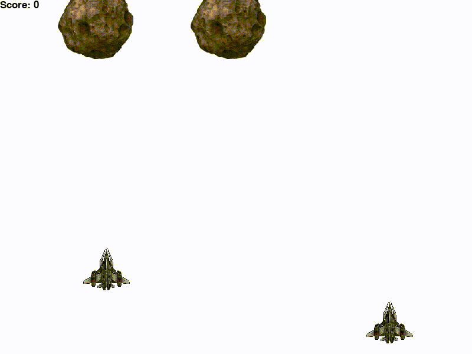

# Drone Wars

## Introduction 
I made this game as a testbed platform for developing an AI agent that avoids asteroids and defeats bad robots. 

## First iteration, simple heuristic agent behaviour 
The agent follows predefined rules for avoiding incoming asteroids, however, does not reach high scores. 

## Second iteration, Reinforcement Learning Deep Q method
The agent is trained with RL Deep Q method. The results are great, agent avoids asteroids at a very high game speed, better than human could. However, it is still not perfect and sometimes a miss happens. Action space contains of 3 actions (left, right, do nothing).

## Third iteration, Centralized Reinforcement Learning with Double Deep Q method and multiple drones
The agent is trained to control 2 drones in a centralised fashion (same policy controls both drones). The game problem complexity is much higher due to increased actions space (9 actions instead of 3) and it took significantly longer time to train the agent to reach reasonable score.

## Fourth iteration, Decentralized Reinforcement Learning with Double Deep Q method and multiple drones
There are two independed agents that are trained in a decentralized fashion. This method achieves the best scores and is most robust. Each agent has it's own policy with 3 actions. Training is taking slightly longer as centralized method due to resource constraints (multiple networks running concurently). 

## Instructions 

There are two implementations to train Double Q Network for Drone Wars, one using Stable Baselines 3 and another custom implementation from scratch using Pytorch. The current DQN implementation outperforms Stabe Baselines 3 - reaches higher scores and is easier to understand.  

### Python scripts
To play the trained model
`python3 play.py`

To train the models from scratch
`python3 train.py`

To train using stable baselines (only centralized method)
`python3 train_stablebaselines.py`

To play the game manually or with a scripted AI: 
`python3 game.py`

### Colab 
Colab notebooks will be provided soon.

## Requirements
* python3
* pygame
* pygame-menu
* torch
* numpy
* stable_baselines3
* gym
* cv2

## Next development steps
* Improve the game 
    * Add cooperative actions for drones
    * The drone can shoot asteroids
    * Add top scores to the menu
    * Add different types of asteroids
    * Add power-ups for the drone
* Improve AI
    * ~~Improve RL method to reach higher scores~~
* Multi-agent 
    * Make drones coordinate and work together
    * ~~Make the game multi-agent so more than 1 drone is playing~~
    * ~~Adapt RL method for multi-agent game setting~~

