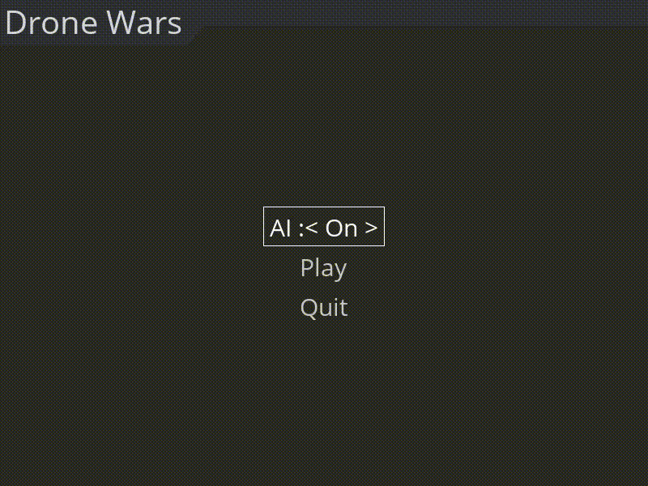
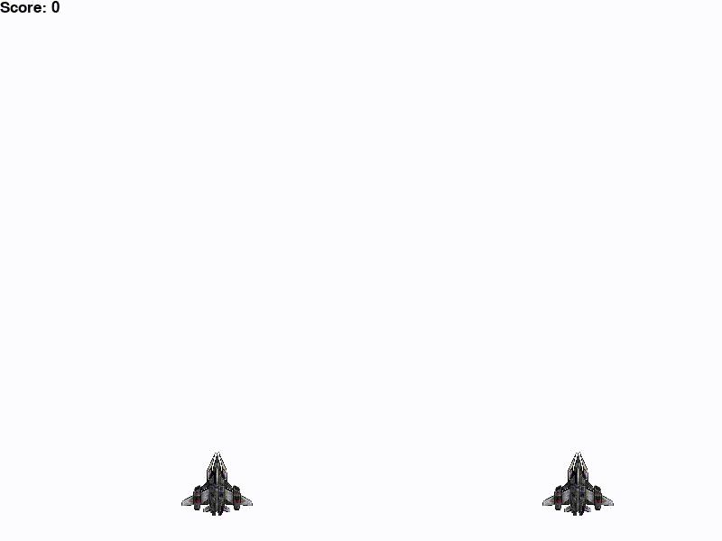

# Drone Wars

## Introduction 
I made this game as a testbed platform for developing an AI agent that avoids asteroids and defeats bad robots. 

## First iteration, simple heuristic agent behaviour 
The agent follows predefined rules for avoiding incoming asteroids, however, does not reach high scores. 

## Second iteration, Reinforcement Learning Deep Q method
The agent is trained with RL Deep Q method. The results are great, agent avoids asteroids at a very high game speed, better than human could. However, it is still not perfect and sometimes a miss happens. 

## Third iteration, Reinforcement Learning with Double Deep Q method and multiple drones
The agent is trained to control 2 drones in a centralised fashion. The game problem complexity is much higher and it took significantly longer time to train the agent to reach reasonable score.
Implementation description will be released soon. 

## Instructions 

To train the agent run:
`python3 train.py`

To train with the Openbaselines3 
`python3 test_dqn.py`

And to play the game with the trained RL agent run:
`python3 play.py`

To play the game manually or with scripted AI run: 
`python3 game.py`

## Requirements
* python 3
* pygame
* pygame-menu
* pytorch
* numpy

## Next development steps
* Improve the game 
    * The drone can shoot asteroids
    * Add top scores to the menu
    * Add different types of asteroids
    * Add power-ups for the drone
* Improve AI
    * Improve RL method to reach higher scores
* Multi-agent 
    * Make the game multi-agent so more than 1 drone is playing
    * Adapt RL method for multi-agent game setting

